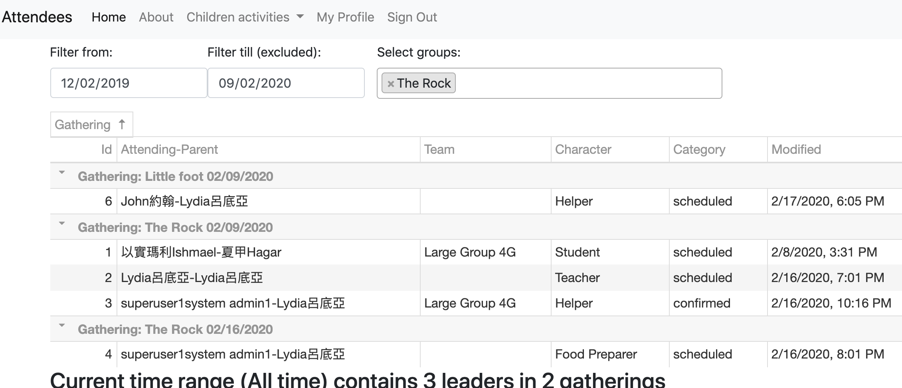

# attendee

## User stories

  
Click to expand all meeting discussions

### Epic user
- As a user, I can login and use the app
- As an administrator, I can assign/update all users to different characters, such as teacher/helper/students, etc.
- As kid program organizer, I can create/update the groups of kid programs, such as "Shining Stars", etc.
- As kid program organizer, I can create/update lessons of kid programs for different quarter/dates, such as Rock@9/1/2019
- As a user, I can see groups and lesson public info of kid programs. (please define public info, such as time/location/stuff to bring/wear, etc)

### Epic parent
- As a parent, I can register/assign/change my kids (to lesson level?)
- As a parent, I can see my kids' lesson info, including dates/time/location(/leading teacher name?)
- As a parent never join kid programs before, given the passcode send to my cell#/email, I can register my kids.
- As a parent, given the passcode send to my cell#/email, I can login with parent's one cell#, zip-code and first name in English of my kids (even if they are twins).

### Epic coworker
- As teacher/coworker, I can see class rosters, which lists teachers/helpers/students/location/time of lessons
- As a teacher/coworker, I can add/change myself to lessons
- As a teacher/coworker, I can assign/change students to lessons
- As a teacher/coworker, I can text/paging parents (future)

### Epic developer
- As a developer of the app, I need to define flexible data structures storing kid programs, including user info and characters, groups, lessons.

### 20191024 meeting notes
- As a parent I can register kids for multiple programs/events.
- As a staff/organizer, I can add/copy kids to the programs/events next year without repeatedly keyin kids' data
- As a staff/organizer, I need to see kids grade, as kids grade may not reflecting their edge, and their grade needs auto-advance every year
- As a user, I can see languages depends on my browser settings (Chinese/English/Spanish, etc) (not in V1)
- As a staff/organizer, I need to see students' siblings relationship  (non real time processing is fine)
- As a non-parent registering kids, I have to enter kid parent info.
- As a coworker I need to register withOUT kids
- As a staff/organizer, when I click each session's class title, I will be linked to google drive for course materials.
- Last, probably redesign a non row-based listing for staff/organizer's day view or student roaster view (mobil phone friendly)

### 20200213 meeting notes
- As a parent I can be notified for the incoming classes, so that I can respond with RSVP or take absent for my kids.
- As a parent I can be notified to update contact info/address for my kids.
- As a coworker I can be notified for the incoming classes, so that I can respond with RSVP or take leave.
- As a organizer(coworkers?) I can be notified early when coworkers take leaves on the incoming class.
- As a organizer(coworkers?) I can assign students to different class, maybe or maybe not from student roaster.
- As a coworker I can take/retract the students attendance anytime in the class or check students attendance after classes.
- As a secretary I can receive all class attendance counts summary periodically.
- As a coworker, I can check or update BOTH age and grade of a student (age and grade of the same student may vary a lot).
- As a coworker, I can see both age and grade of a student (age and grade may vary a lot) periodically advanced automatically.
  
#### page priority 
- student roasters (with their medical concerns, parent contact, and possibly other participations) for the incoming classes
- leader/coworker list for the incoming classes (for teacher availability and arrangement)

#### how to direct parents/coworker to use app (my own thoughts)
- Need to have some real data (secretary address database in MS Access)
- Initial registration by invite to parents/coworkers email/phone (combine with yearly contact update page)

## mockup
https://marvelapp.com/9dj5heb

## data models
https://dbdiagram.io/d/5d5ff66eced98361d6dddc48

## How to start dev env

* clone the repo, for example, `git clone https://github.com/xjlin0/attendees.git`
* check local python version, Django coockie cutter is developed with Python 3
* There is no need to have local Django or Postgres running, but on MacOS you will need Virtualbox from https://www.virtualbox.org
* This is docker machine based CentOS, please install docker by `wget -qO- https://get.docker.com/ | sh && sudo usermod -aG docker centos`.
* Install docker compose by `sudo curl -L "https://github.com/docker/compose/releases/download/1.23.2/docker-compose-$(uname -s)-$(uname -m)" -o /usr/local/bin/docker-compose && sudo chmod +x /usr/local/bin/docker-compose`
* start the local docker machine by `sudo systemctl start docker`
* start a docker machine named "dev" by `docker-machine create --driver virtualbox dev`
* get all env variables from "dev" by `eval $(docker-machine env dev)`
* build and start the local machine by `docker-compose -f local.yml build && docker-compose -f local.yml up -d`
* create migration files by `docker-compose -f local.yml run --rm django python manage.py makemigrations`
* migrate db by `docker-compose -f local.yml run --rm django python manage.py migrate`
* create a superuser by `docker-compose -f local.yml run --rm django python manage.py createsuperuser`
* import the seed data by `docker-compose -f local.yml run django python manage.py loaddata fixtures/db_seed`
  (data were created by `docker-compose -f local.yml run django python manage.py dumpdata --exclude users.user --exclude admin.logentry --exclude sessions.session --indent 2 > fixtures/db_seed.json`)
* use browser to open http://192.168.99.100:8000/ and http://192.168.99.100:8025/
* Enter postgres db console by `docker-compose -f local.yml exec postgres psql --username=YBIJMKerEaNYKqzfvMxOlBAesdyiahxk attendees_development`
* Enter Django console by `docker-compose -f local.yml run django python manage.py shell_plus`

